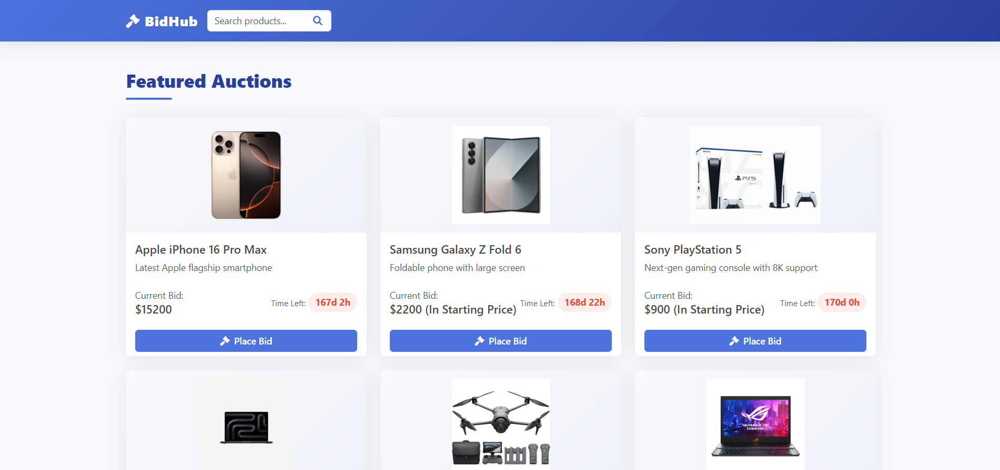
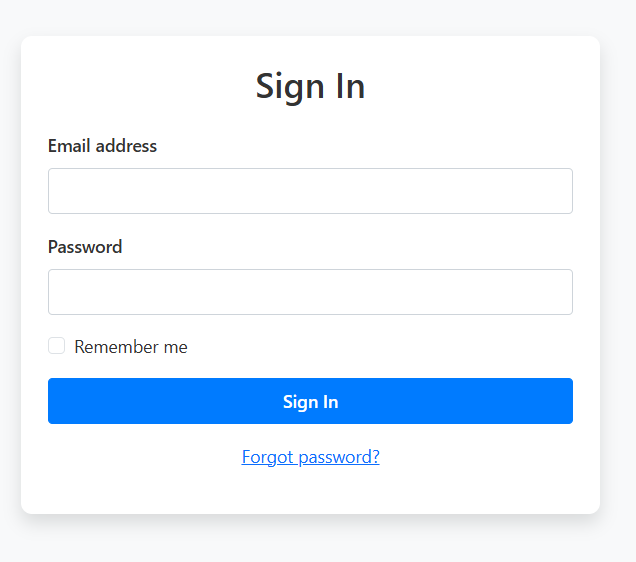
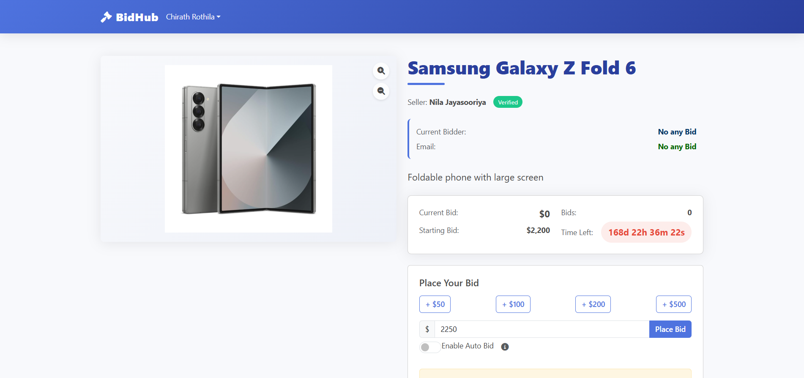
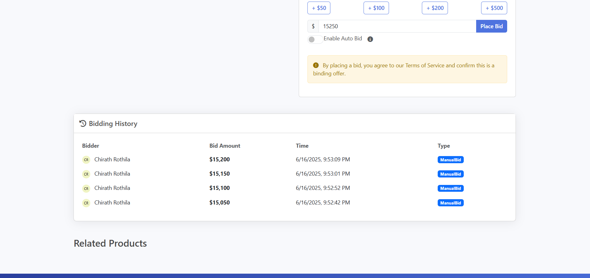
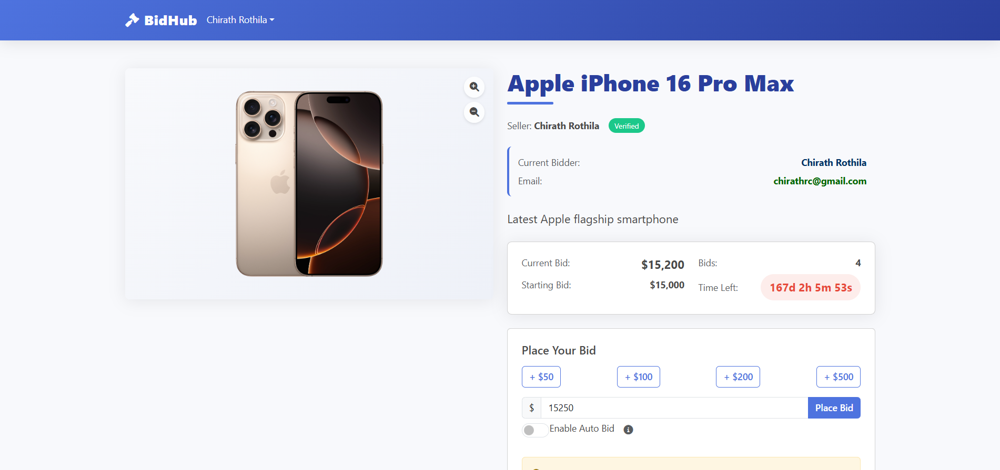

# BidHub 🧩

*A Distributed Online Auction System built with J2EE*

## 🔍 Overview

**BidHub** is a scalable, modular, and database-free **Distributed Online Auction System** developed using **Java EE technologies** such as **EJB**, **JMS**, **JSP**, and **WebSocket (Payara)**. It simulates real-time bidding scenarios with support for **manual and auto-bidding**, designed for academic, enterprise learning, and demonstration purposes.

This project follows a clean modular architecture divided into:

* `core`: DTOs, utility classes, and shared logic.
* `ejb`: EJB beans for business logic and state management.
* `web`: HTML pages and servlets for the user interface.
* `ear`: EAR packaging to bundle everything into a deployable unit.

---

## 🛠️ Technologies Used

* **Java 11**
* **J2EE / Jakarta EE**

    * EJB (Stateless Session Beans)
    * JMS (Java Messaging Service)
    * Servlets
    * WebSocket (Payara Server)
* **Gson** for JSON parsing
* **Payara Server** for deployment
* **No database used** – static in-memory collections simulate persistence

---

## 📦 Architecture

The system follows a **multi-tiered architecture** with clear separation of concerns:

```plaintext
 Client (Browser)
       ↓
 Web Tier (Servlet + HTML (JS,CSS))
       ↓
EJB Tier (Business Logic with Session Beans)
       ↓
Core Module (DTOs, Static Repositories)
```

JMS is used for real-time communication between bidding components and UI updates using WebSocket.

---

## ✨ Key Features

### 🔐 User Management

* Registration and login using session beans
* Data stored in-memory without a database

### 🛍️ Product Catalog

* Products are loaded statically using a shared list
* No external DB dependency

### ⚙️ Bidding System

* Manual bids processed with concurrency safety
* Auto-bidding engine that automatically increments up to a user’s max limit

### ⏱️ Real-time Bidding with JMS + WebSocket

* JMS topics broadcast bid updates
* Web clients receive instant updates via WebSocket

### 🔄 Bid Prioritization

* Manual bids temporarily pause auto-bids
* Queue-based bid handling for fairness and order

---

## 📂 Module Structure

```
BidHub/
├── core/           # DTOs, Static data
├── ejb/            # EJBs (Session Beans, Bid Manager, AutoBid Manager)
├── web/            # HTML pages, Servlets, WebSocket endpoints
├── ear/            # EAR module with application.xml
└── README.md
```

---

## 🔧 How to Run

1. **Use JDK 11**
2. **Import as a Maven multi-module project** in IntelliJ or Eclipse
3. Deploy the EAR module to **Payara Server**
4. Access via browser:
   `http://localhost:8080/BidHub-web`

---

## 🖼️ Screenshots

### ▶️ Home Page



### 👤 Registration & Login




### 💰 Live Bidding Page

  
*Bidding Screen 1*

  
*Bidding Screen 2*

  
*Bidding Screen 3*

---

## 📘 Future Improvements

* Add database support (JPA + PostgreSQL)
* Add auction timer and item expiration
* Admin dashboard for auction analytics
* Mobile responsiveness for bidding UI

---

## 🤝 Contributions

Pull requests are welcome! For significant changes, please open an issue first to discuss what you’d like to change.

---

## 📄 License

MIT License

Copyright (c) 2025 Chirath Rothila

Permission is hereby granted, free of charge, to any person obtaining a copy
of this software and associated documentation files (the "Software"), to deal
in the Software without restriction, including without limitation the rights
to use, copy, modify, merge, publish, distribute, sublicense, and/or sell
copies of the Software, and to permit persons to whom the Software is
furnished to do so, subject to the following conditions:

The above copyright notice and this permission notice shall be included in all
copies or substantial portions of the Software.

THE SOFTWARE IS PROVIDED "AS IS", WITHOUT WARRANTY OF ANY KIND, EXPRESS OR
IMPLIED, INCLUDING BUT NOT LIMITED TO THE WARRANTIES OF MERCHANTABILITY,
FITNESS FOR A PARTICULAR PURPOSE AND NONINFRINGEMENT. IN NO EVENT SHALL THE
AUTHORS OR COPYRIGHT HOLDERS BE LIABLE FOR ANY CLAIM, DAMAGES OR OTHER
LIABILITY, WHETHER IN AN ACTION OF CONTRACT, TORT OR OTHERWISE, ARISING FROM,
OUT OF OR IN CONNECTION WITH THE SOFTWARE OR THE USE OR OTHER DEALINGS IN THE
SOFTWARE.

---

Let me know if you want help generating [realistic screenshots](f) from mockups or adding [project setup instructions](f).
